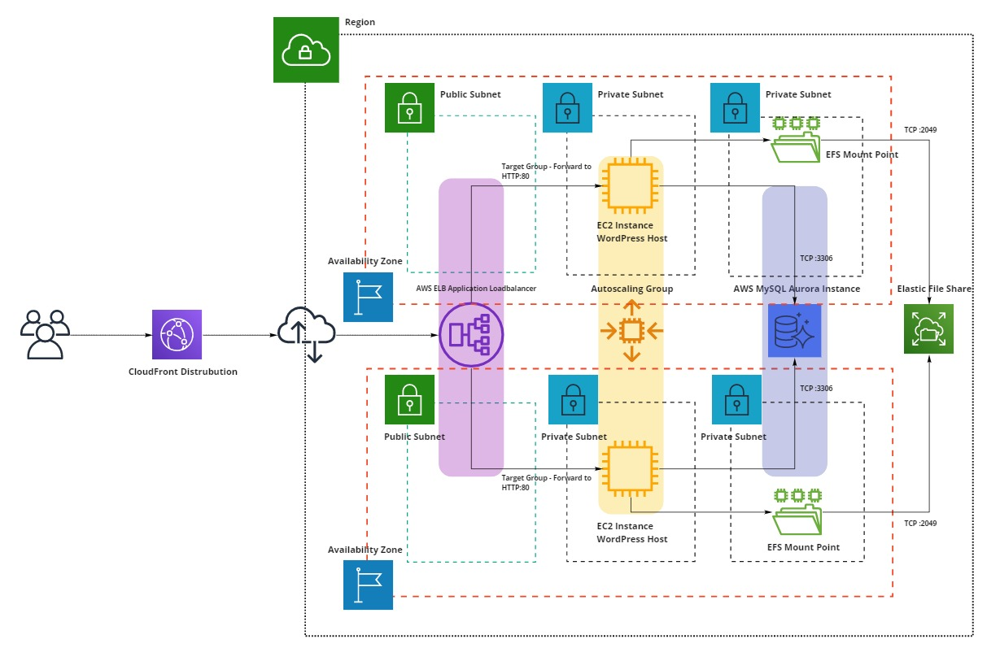

## Purpose

The purpose of this module is to create a pattern for deploying WordPress solutions. The AMI that is used when creating this pattern was created by the AMI builder solution. See additional reading for the link to the AMI builder solution. 

#### Source Code Structure and Account of Resources
_____________________

```bash
├── policies                      <-- Templates for all policies that will be created
│   ├── efs_policy.json
|   ├── kms_policy.json                    
│   └── s3_policy.json    
├── scripts                       <-- Script thats used in the userdata for launch configuration to mount the efs share
|   └── userdata.sh                  
├── test                          <-- Example of the test case
│   └── test.tf
├── alb.tf                        <-- Application Load Balancer Resources i.e. ALB, Listeners and Target Groups
├── data.tf                       <-- Reading template files to create policies
├── ec2.tf                        <-- EC2 Resouces i.e. Launch Configuration, ASG, userdate
├── efs.tf                        <-- EFS resource and the EFS mounts points in the data subnets
├── iam.tf                        <-- IAM Resources i.e. Roles, Policies and policy attachments
├── rds.tf                        <-- Resources for RDS. RDS instance and Clusters
├── security_groups.tf            <-- Security Groups for the RDS and EC2 instance
└── variables.tf                  <-- Variable used in the module
```

#### Usage of the WordPress Terraform Module
_____________________

```ruby
module "wordpress" {
    source = "http://git.sanlam.co.za/scm/cloudenablement/module-aws-wordpress.git"

    # Networking Vars
    vpc_id                     = "vpc-0306eda6f9928750e"
    app_subnet                 = ["subnet-0539b64619def41d1", "subnet-08a335a2d951f52b3"]
    data_subnet                = ["subnet-08a335a2d951f52b3", "subnet-09527f39c4ff0b8cb"]
    
    # Application Server Vars
    ec2_instance_type          = "t3.medium"
    s3-deployment_bucket_arn   = "arn:aws:s3:::wordpress-deployment-bucket"
    
    # Database Vars
    family                     = "aurora-mysql5.7"
    db_family                  = "aurora-mysql5.7"
    db_port                    = 3306
    cluster_family             = "aurora-mysql5.7"
    engine                     = "aurora-mysql"
    engine_version             = "5.7.mysql_aurora.2.03.2"
    db_instance_class          = "db.t3.medium"

    # Business Vars
    environment                = "poc"
    buen                       = "sgti"
    application                = "wordpress"
}
```
#### Issues and Bugfixes
______________________
- Use Route53 and create a certificate using ACM to create an HTTPS listener on the ALB
- Lockdown security groups to the CIDR ranges of the Subnets they're deploying into
- Use the 3 tier VPC model, so that the applications servers can be deployed into a private subnet
- Edit the FSTAB entry on the ec2 instance, to the EFS file share is always mounted at boot 

### Reference Architecture Diagram



### Additional Reading
[WordPress Best Practices](https://aws.amazon.com/blogs/architecture/wordpress-best-practices-on-aws/)

[AMI Builder Solution](http://git.sanlam.co.za/projects/CLOUDENABLEMENT/repos/solution-aws-ami-builder/browse)

